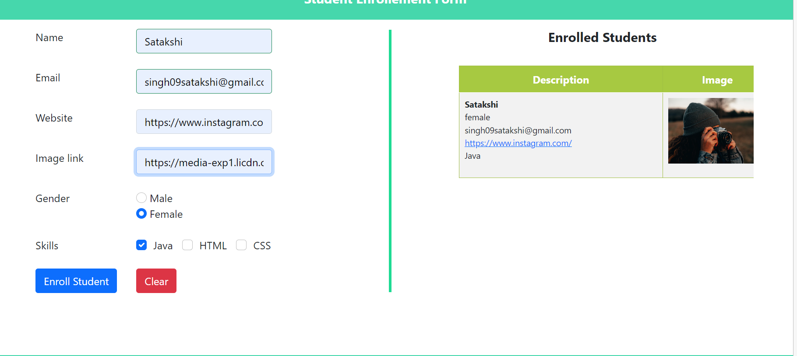

# EnrollmentApplication
This is a web application for enrolling students. It allows users to fill out a form with student details, validates the inputs, and adds the enrolled students dynamically to a table. The application is built using HTML5, CSS3, JavaScript, and the Bootstrap framework.

## Features

- Form validation for all fields with error messages on validation failure.
- Dynamic addition of enrolled students to a table using JavaScript.
- Loading images from submitted URLs.
- Opening website links in a new tab on clicking.
- Fade-in effect for newly added enrollments using CSS animations.
- Responsive design for various resolutions and screen sizes.

## Getting Started

To use this application locally, follow these steps:

1. Clone the repository: `git clone [https://github.com/Satakshi09/EnrollmentApplication]`
2. Open the `index.html` file in a web browser.
3. Fill out the enrollment form and submit.
4. The enrolled student will be added to the table with a fade-in effect.

